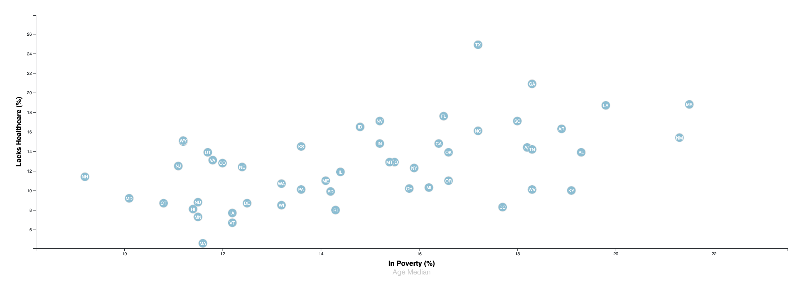
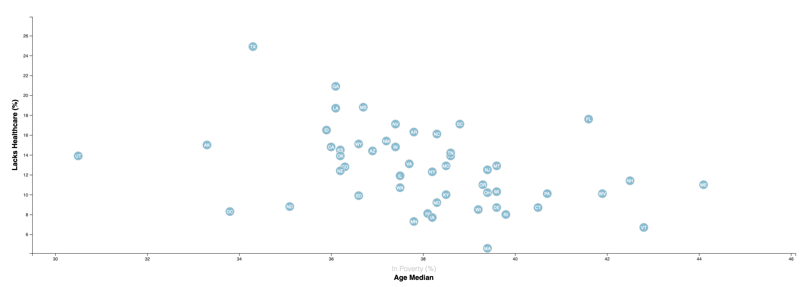

# Data Journalism and D3

## Introduction
This challnege is to create a data visualization position for a major metro paper. The task is to analyse the current trends about the health risks facing particluar demographics and create an interactive scatter plot to help readers understand the findings.

## Data
From U.S. Census Bureau and the Behavioral Risk Factor Surveillance System:
* [2014 ACS 1-year estimates](assets/data/data.csv)

## Visualisation
Create a scatter plot between two of the data variables such as `Lacks Healthcare vs. Poverty`.
* Include state abbreviations in the circles
* Create and situate your axes and labels to the left and bottom of the chart
* Add `Age Median` to the scatter plot and give a click event so that allow users to shift the data to display

## Copyright

Trilogy Education Services © 2021. All Rights Reserved.
